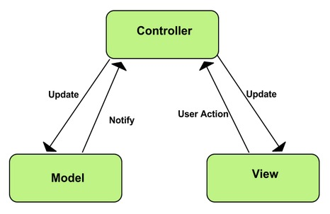
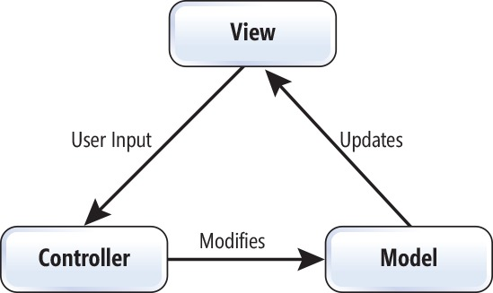

## SYSC3110 Project

### THE TEAM :sparkles:
* Team Name: //TODO: Get team name
* Members:
  * Mariam Almalki
  * Nazifa Tanzim
  * Taher Shabaan
  * Hassan Hassan
  
  Note: Abdulla Al-wazzan was part of our team but has now switched to another team.
  
### CONTENTS OF THIS README
* Description of Current Version
* Changes from Previous Version
* User Manual
  * The Main Class
  * How to Play
* Design Decisions
* Known Issues
* Team Member Roles
* Roadmap Ahead

### Description of Current Version:
An MVC model is implemented with the game GUI, controller, and model to allow the game to be playable using the mouse. In addition, JUnit tests were added for the model logic testing if the expected results are achieved.
The documentation for this version includes the sequence diagrams, an updated UML, CRC cards, design decisions, team member roles and responsibilities, a user manual, and the road map ahead.

Milestone 2 consists of reimplemented model with new classes such as Fox, rabbit, Piece, Mushroom, Command, CommandWord, Parser to enable more encapsulation and decoupling in the model. JUnit tests were added and reimplementation of the game using MVC design pattern. A sequence diagram was created for milestone 1. The feedback from milestone 1 was implemented and the changes can be found on branch Milestone1V.

### Changes from Previous Version:
Milestone 3 has new classes Node and Solver to implement the hint button functionality. Method to validate Fox and Rabbit moves were moved to their respective classes. JUnit tests were added and fixed to test new and altered classes. Additional buttons and their functionalities were implemented (undo, redo, reset, hint).

### User Manual:
The main class for this version of the project is called Main.java in the JumpIn package. The game is played using the mouse by pressing the animal to be moved first then pressing on the desired location for the animal to be placed.
The following are the list of menu options you can use: quit help hint reset undo redo 
	quit will end the game.
	hint will highlight the piece to move and the location to move it to in order to do in order to solve the puzzle.
	undo will undo the last move
	redo will undo any undos that were previously done.
	reset will start the game from the beginning.
	help will display the following instructions:
		
The obstacles are: Mushroom, Fox, Rabbit.

The following explains how the obstacles move around the board:

Rabbit:	Rabbits can only move by jumping over one adjacent obstacle. Once a rabbit is in a hole, it can be jumped over 	by other rabbits. 
Side note: Rabbits can jump out of their holes to facilitate another rabbit's path. Rabbits can jump over a fox's waist, or from its head to tail or tail to head. 

Foxes: Foxes can slide depending on their initial direction, however many spots needed.

Mushrooms and holes are stationary. 

The objective of the game is to move the rabbits and foxes, through a series of movements
around the obstacles until all the rabbits are safely in their hole.

### Design Decisions:

###### Milestone 2:
Throughout the research process for this milestone, the team found two different ways to implement the MVC pattern. The first way is shown in figure 1 and the second is shown in figure 2. The team worked on both ways in order to see which is best suited for the task. The team decided to use the method in Figure 1 since it was found to be simpler. The implementation of the second way can be found in the HassanController branch. 

Figure1

Figure2

It was decided to pass the model to the view so that the view can be constructed based on the objects in the model. This makes the code more cohesive and the classes work together, and so that nothing exists in the model that doesn’t exist in the view or vice versa.  

Also, for the model, classes were made for most of the pieces on the board to reduce the smell of the code and help differentiate between the different components of the code. Command, CommandWord and Parser class were implemented to get commands from the user using the GameView(Graphical User Interface) or the console. This decision was based on the feedback received for Milestone 1.

We decided to change the implementation of Fox such that a fox object can represent either a fox’s head or a fox’s tail, and each object is associated with it’s corresponding piece. This implementation proved to be better because then each part can be mapped to its appropriate image.

Similarly, we added a colour attribute to Rabbits, so that the right image can be used for each.

###### Milestone 3: 
For this milestone, we had to implement undo/redo functionality as well as a solver for the game. 

For the solver, it was decided to use breadth first search instead of depth first search so that we can find the shortest path to the solution. In the future, if harder levels take too long, we may decide to switch to depth first in order because it is more efficient. 

Hashcodes were used in order to eliminate any nodes that have already been visited (so that we don't visit them again)

Each node stores it's parent node, which is used so that the solution can be traced back to the source. 

For the undo/redo functionality, a stack of commands was used such that every time one of the buttons is pressed the corresponding stack pops the top command and sends it to the game for processing. 

Many elements were moved out of the controller to the view. This is because it contained many functional interfaces that weren't necessary. Therefore, some buttons (such as help, quit, undo/redo) simply used lambdas to route back to the methods that would have been called had the action went through the controller and then the model. This also reduced the amount of code written by a significant amount. 

### Known Issues:
No known issues as of now.

### Team member roles:
**Mariam Almalki**: Made it so that Fox and Rabbit handle their own moves. Created Node and Solver classes and functionality. Implemented hint button functionality (outputs next command in console). Fixed issues with reset button. Worked on sequence diagram for Milestone 3. Created UML diagram.

**Nazifa Tanzim**: Created and implemented undo and redo buttons, as well as initial version of reset button. Implemented hint display in view. Worked on sequence diagram.

**Taher Shabaan**: Fixed issues with icons disappearing from package after initially pulling repository. Fixed existing JUint tests for classes that were altered. Worked on sequence diagram. 

**Hassan Hassan**: Refined alternate MVC of code that was not implemented to reflect (can be found in branch HassanController). Worked on JUnit testing for new classes that were created. Worked on sequence diagram. 

### Things to Note:
1.The design not used for connecting the MVC together was worked on in the HassanController branch.

### Roadmap Ahead
Add Save/Load features using a database to the game to allow the user to save the positions of the pieces in the game and come back to it later to continue playing the game. Add levels using XML/JSON.
