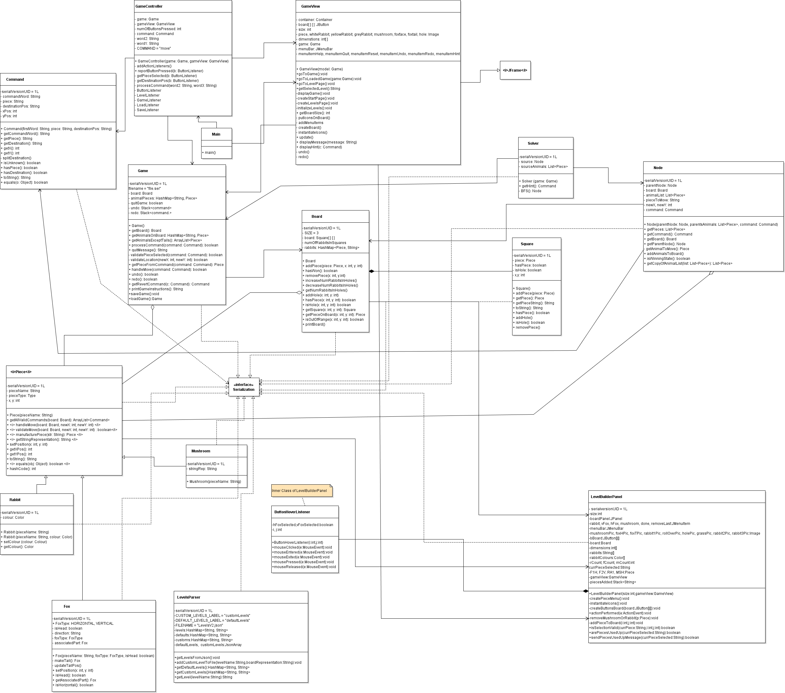
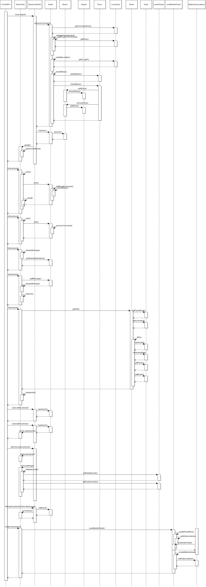

## SYSC3110 Project

### THE TEAM :sparkles:
* Team Name: //TODO: Get team name
* Members:
  * Mariam Almalki
  * Nazifa Tanzim
  * Taher Shabaan
  * Hassan Hassan
  
  Note: Abdulla Al-wazzan was part of our team but has now switched to another team.
  
### CONTENTS OF THIS README
* Description of Current Version & Changes from Previous Version
* User Manual
  * The Main Class
  * How to Play
  * Level Builder
  * Save/Load feature
* Design Decisions
* Known Issues
* Team Member Roles
* Roadmap Ahead
* UML
* Sequence Diagram

### Description of Current Version & Changes from Previous Version:
Milestone 4 now lets the player save/load their progress in the game. The user can also build their own level and choose between default levels to play. 
Sequence diagram and UML and all other contents of this UML were updated. 

An MVC model is implemented with the game GUI, controller, and model to allow the game to be playable using the mouse. In addition, JUnit tests were added for the model logic testing if the expected results are achieved.
The documentation for this version includes the sequence diagrams, an updated UML, CRC cards, design decisions, team member roles and responsibilities, a user manual, and the road map ahead.

Milestone 2 consists of reimplemented model with new classes such as Fox, rabbit, Piece, Mushroom, Command, CommandWord, Parser to enable more encapsulation and decoupling in the model. JUnit tests were added and reimplementation of the game using MVC design pattern. A sequence diagram was created for milestone 1. The feedback from milestone 1 was implemented and the changes can be found on branch Milestone1V.

### User Manual:
The main class for this version of the project is called Main.java in the JumpIn package. The game is played using the mouse by pressing the animal to be moved first then pressing on the desired location for the animal to be placed.

####Game Rules
The following are the list of menu options you can use: _quit help hint reset undo redo_\
      _quit_ will end the game.\
      _hint_ will highlight the piece to move and the location to move it to in order to do in order to solve the puzzle.\
      _undo_ will undo the last move.\
      _redo_ will undo any undos that were previously done.\
      _reset_ will start the game from the beginning.\
      _help_ will display the following instructions:
		
The obstacles are: Mushroom, Fox, Rabbit.

The following explains how the obstacles move around the board:

Rabbit:	Rabbits can only move by jumping over one adjacent obstacle. Once a rabbit is in a hole, it can be jumped over 	by other rabbits. 
Side note: Rabbits can jump out of their holes to facilitate another rabbit's path. Rabbits can jump over a fox's waist, or from its head to tail or tail to head. 

Foxes: Foxes can slide depending on their initial direction, however many spots needed.

Mushrooms and holes are stationary. 

The objective of the game is to move the rabbits and foxes, through a series of movements
around the obstacles until all the rabbits are safely in their hole.

####Make A Level
You can now create and play your own level! Simply press 'Start New Game' then 'Build Level' in the bottom right corner. Select the piece you'd like to put on your board and find a suitable place for it. 

You can press CTRL-Z or 'Undo' to undo the last placement you made. 

You are limited to 2 foxes, 3 rabbits, and 3 mushrooms. 

If the puzzle you made is unsolveable, you won't be able to save it!

####Save Game State
You can now save your progress for a game! Simply press 'save' while playing and when you come back you can press 'load' and be taken back to exactly where you were. 

### Design Decisions:

###### Milestone 2:
Throughout the research process for this milestone, the team found two different ways to implement the MVC pattern. The first way is shown in figure 1 and the second is shown in figure 2. The team worked on both ways in order to see which is best suited for the task. The team decided to use the method in Figure 1 since it was found to be simpler. The implementation of the second way can be found in the HassanController branch. 

Figure1

Figure2

It was decided to pass the model to the view so that the view can be constructed based on the objects in the model. This makes the code more cohesive and the classes work together, and so that nothing exists in the model that doesn’t exist in the view or vice versa.  

Also, for the model, classes were made for most of the pieces on the board to reduce the smell of the code and help differentiate between the different components of the code. Command, CommandWord and Parser class were implemented to get commands from the user using the GameView(Graphical User Interface) or the console. This decision was based on the feedback received for Milestone 1.

We decided to change the implementation of Fox such that a fox object can represent either a fox head or a fox tail, and each object is associated with it’s corresponding piece. This implementation proved to be better because then each part can be mapped to its appropriate image.

Similarly, we added a colour attribute to Rabbits, so that the right image can be used for each.

###### Milestone 3: 
For this milestone, we had to implement undo/redo functionality as well as a solver for the game. 

For the solver, it was decided to use breadth first search instead of depth first search so that we can find the shortest path to the solution. In the future, if harder levels take too long, we may decide to switch to depth first in order because it is more efficient. 

Hashcodes were used in order to eliminate any nodes that have already been visited (so that we don't visit them again)

Each node stores it's parent node, which is used so that the solution can be traced back to the source. 

For the undo/redo functionality, a stack of commands was used such that every time one of the buttons is pressed the corresponding stack pops the top command and sends it to the game for processing. 

Many elements were moved out of the controller to the view. This is because it contained many functional interfaces that weren't necessary. Therefore, some buttons (such as help, quit, undo/redo) simply used lambdas to route back to the methods that would have been called had the action went through the controller and then the model. This also reduced the amount of code written by a significant amount. 

We removed classes such as Parser and CommandWord as well as methods such as play() and startNewRound() because they were made specifically for the text based game and are now unused. 

We decided to change the way that a Fox is created: instead of creating a Fox head and a Fox tail and then associating them with eachother, we made it so that once a Fox head is created, it automatically creates a an associated Fox tail. This was necessary for the solver so that the two pieces move together, and so that only the fox head can be included in the array of animals such that we are not checking two extra pieces unnecessarily. 

###### Milestone 4:
For this milestone, we had to include the option of multiple levels as well as impload a save/load feature and a level builder. 

For the level selector, we decided to let the user choose which level to start with and then go back and choose another level in case they want something easier / harder (instead of immediately going to the next highest level after they finish one)

For the level builder, we decided to create a new class that extends panel that will appear if that option is chosen. In this class, a mouse listener was used on the grid panel to show the user all the possible places that they can place their pieces. We decided to stick to the original JumpIn game rules and limit the number of pieces that the user can place on the board. 

For the save/load, it was decided to only allow the user to save their most recent game (i.e. everytime 'save' is pressed it overrides the previous save). This was done to allow the user to just pick up from where they left off last time. 

### Known Issues:
After playing a level, if the user goes back to the start page pressing 'Start new game' will result in an error.

### Team member roles:
**Mariam Almalki**: Implemented level builder and level parser

**Nazifa Tanzim**: Created GUI for level selection and handled panel logic for GUI. 

**Taher Shabaan**: Worked on Save/Load feature and testing

**Hassan Hassan**: Worked on Save/Load feature and testing

All members contributed to documentation and design decisions. 

### Things to Note:
1. In the level builder, if 'back' was pressed after 'save' it will still prompt to save, just in case user made any new changes. 

### Roadmap Ahead
We think we'll take a break for now :) But, features to add in the future can include:
 - Let user save multiple levels.
 - Let user delete some of their custom levels
 

### UML
The following UML is also attached as a .violet.html file in the documentation (can be opened and viewed in a browser if downloaded)

### Sequence Diagram

